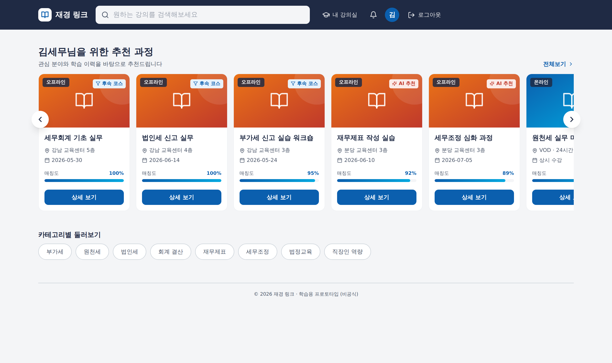
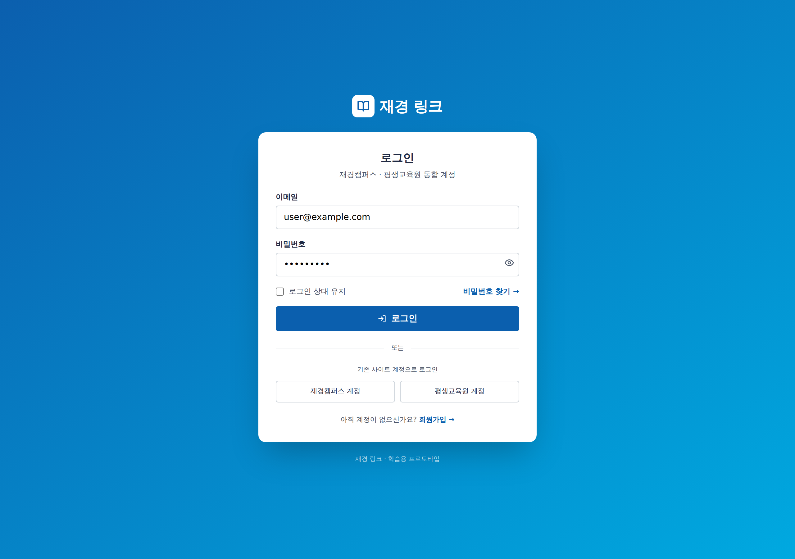
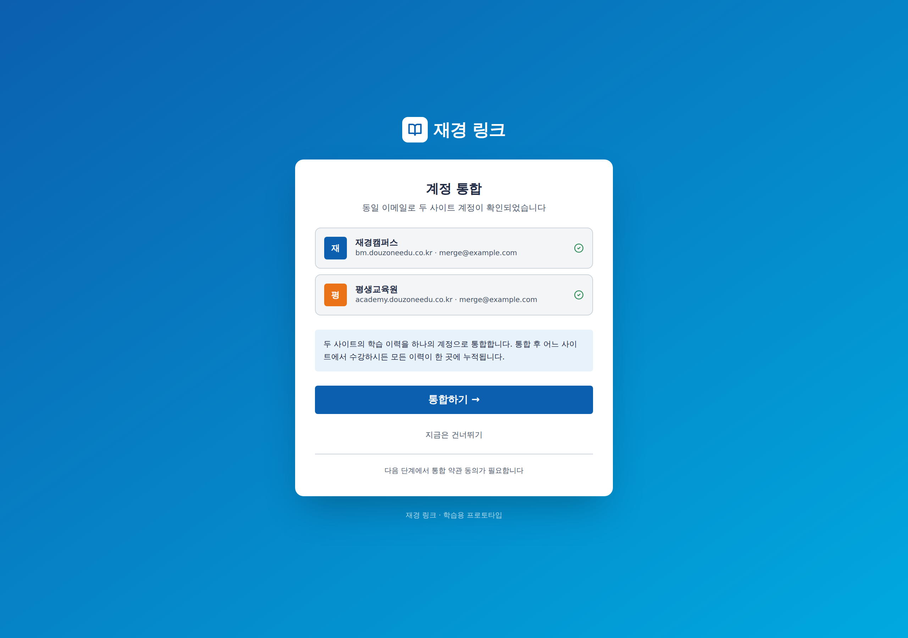
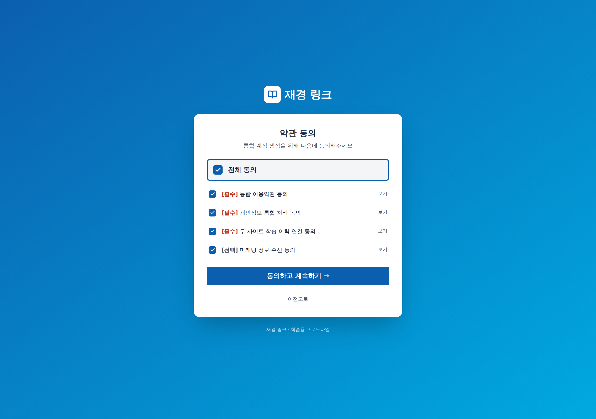
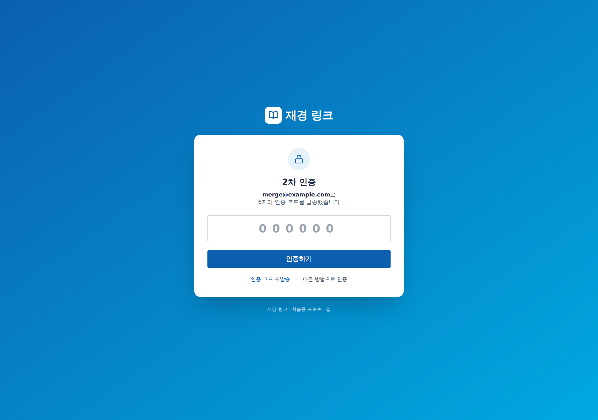

<div align="center">

# 재경 링크 (Jaegyeong Link)

회계·세무 실무자를 위한 **온·오프라인 통합 학습 플랫폼** — 프론트엔드 프로토타입

[](https://react.dev)
[](https://vitejs.dev)
[](https://tailwindcss.com)
[](#)

</div>

> [!NOTE]
> **본 저장소는 학습용 개인 프로젝트입니다.** 인턴십 교육 과정에서 작성한 프론트엔드 연습
> 결과물이며, 특정 기업의 공식 제품·서비스·로드맵이 아닙니다. 등장하는 서비스명·도메인은
> O2O 학습 플랫폼이라는 가상 시나리오를 설명하기 위한 예시이고, 모든 데이터(사용자·추천·
> 일정)는 **목(mock)** 입니다. 백엔드·DB 연동은 없으며 로그인/회원가입은 동작 시연용 가짜입니다.



---

## 한 줄 소개

온라인 강의로 기초를 다진 학습자를 오프라인 워크숍과 자연스럽게 연결하는 O2O 학습 경로를
가정하고, 그 핵심 화면(통합 로그인 · 추천 메인)을 React로 구현한 프로토타입이다.

## 주요 특징

- **통합 로그인 + 인증 후속 3단계** — 계정 통합 안내(1클릭) → 약관 동의 → 2차 인증(mock)
- **하이브리드 추천 엔진 (개념)** — 룰 → 벡터 유사도 → LLM 재순위의 3단계 구조를 가정하고,
  카드에 추천 단계 뱃지와 추천 이유를 함께 표시 (실제 연동 없이 mock 데이터로 시연)
- **추천 카드 캐러셀** — 스와이프 + 좌우 화살표. 9개 카드 중 한 화면에 약 5개 노출
- **인터랙션 구현** — 카테고리 필터 · 검색 · 카드 상세 모달 · 수강 신청(mock) · 토스트 피드백
- **Atomic Design** — atoms 7 · molecules 7 · organisms 5 · pages 5로 책임 분리

## 미리보기

| 통합 로그인 | 계정 통합 안내 | 약관 동의 |
|:---:|:---:|:---:|
|  |  |  |

| 2차 인증 (mock) | 메인 — 추천 캐러셀 |
|:---:|:---:|
|  |  |

## 인증 플로우

이메일에 `merge`가 포함되면 통합 흐름, 그렇지 않으면 단순 흐름으로 진입한다.
한 화면에서 두 시나리오를 모두 시연하기 위한 분기다.

```
[로그인] ─→ [계정 통합 안내] ─→ [약관 동의] ─→ [2차 인증] ─→ [메인]
   |                                              ^
   +──────────── (이미 통합된 사용자) ─────────────+
```

| 경로 | 이메일 예시 | 흐름 |
|---|---|---|
| 통합 흐름 | `merge@example.com` | `/login → /mergeNotice → /terms → /twoFactor → /main` |
| 단순 흐름 | `user@example.com` | `/login → /twoFactor → /main` |

## 기술 스택

| 영역 | 선택 | 비고 |
|---|---|---|
| 빌드 | Vite 5 | 빠른 HMR, ESM 네이티브 |
| 프레임워크 | React 18 | 함수형 컴포넌트 + Hooks |
| 라우팅 | React Router 6 | 선언적 라우트 + Protected Route |
| 스타일 | Tailwind CSS 3 | 디자인 토큰을 theme.extend에 등록 |
| 아이콘 | lucide-react | stroke 기반 아이콘 세트 |
| 폰트 | Pretendard | CDN 로드 |

## 디렉토리 구조

```
.
├── src/
│   ├── App.jsx                       # 라우팅 + Protected Route
│   ├── main.jsx                      # 진입점 (ToastProvider 포함)
│   ├── index.css                     # Tailwind base
│   ├── design/tokens.js              # 디자인 토큰 단일 출처
│   ├── data/                         # mock 데이터 (user, recommendations 9건)
│   ├── components/
│   │   ├── atoms/                    # 7개
│   │   ├── molecules/                # 7개
│   │   ├── organisms/                # 5개
│   │   └── feedback/Toast.jsx        # 클릭 피드백 토스트
│   └── pages/                        # 5개 (Login, MergeNotice, Terms, 2FA, Main)
├── screenshots/                      # README용 5장
└── scripts/screenshot.js             # 자동 캡처
```

## 실행

```bash
npm install
npm run dev      # http://localhost:5173
npm run build    # dist/ 정적 빌드
```

## 구현 범위와 그 이후

| 범위 | 현재 (프로토타입) | 이후 확장 시 |
|---|---|---|
| 인증 | mock 응답 + 페이지 분기 | 실제 OAuth / JWT |
| 추천 | mock 9건 + 캐러셀 UI | API 연동 |
| 카드 클릭 | 모달 + 신청 완료(mock) | 과정 상세 페이지 |
| 상태 보존 | 메모리 | localStorage / 서버 세션 |
| 검색·필터 | 클라이언트 mock 필터 | 백엔드 연동 |

---

<sub>학습용 프론트엔드 프로토타입 · React 연습 프로젝트</sub>
